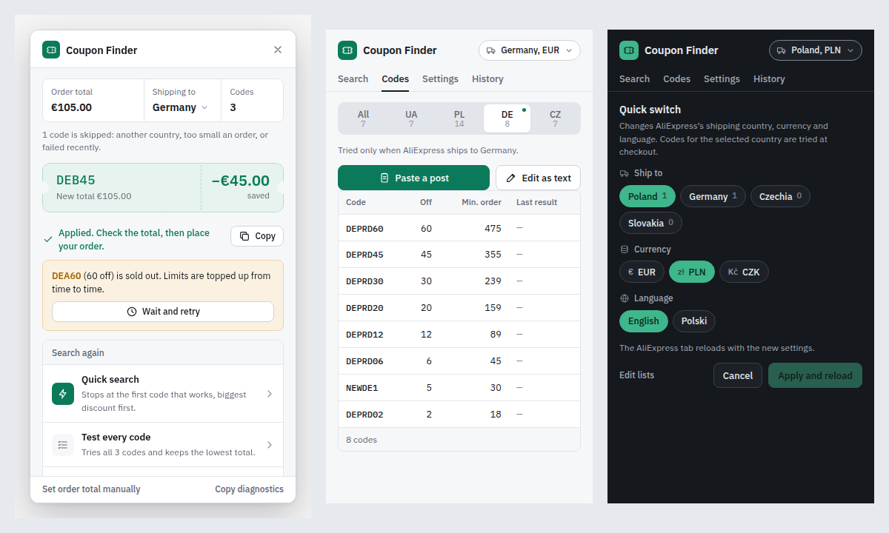

# Ali Coupon Finder

A browser extension that tries promo codes on the AliExpress checkout page and keeps the one that gives the lowest total. It can wait for sold-out codes and apply them as soon as their limit is topped up, and it switches AliExpress's shipping country, currency and language in one tap.

Works in Chrome, Edge, Brave, Opera and other Chromium browsers. Not affiliated with AliExpress.



## Install

1. Open the [latest release](../../releases/latest) and download **ali-coupon-finder-vX.Y.Z.zip**.
2. Unzip it into a folder you'll keep. The browser loads the extension from that folder, so don't delete it.
3. Open `chrome://extensions` (in Edge: `edge://extensions`).
4. Turn on **Developer mode**.
5. Select **Load unpacked** and choose the unzipped folder (the one that contains `manifest.json`).
6. Pin the extension: puzzle icon in the toolbar, then the pin next to Ali Coupon Finder.

Prefer the source? Use **Code → Download ZIP** on this page, unzip it, and in step 5 choose the `extension` folder inside.

**Updating:** download the new release, replace the files in the same folder, and select the reload icon on the extension's card in `chrome://extensions`. Your codes and settings are kept.

## Add codes

Open the extension, go to **Codes**, select **Paste a post** and paste a whole post with codes (for example from Telegram). Codes are sorted into countries using the post's headings, like "🇩🇪 Germany (DE)", "POLAND" or "Global codes (until 8 October)". The discount, minimum order and end date are read from lines like:

```
DEPRD60 — 60€ from 475€
PLLD02 / AFCEOCD2 — 1.81€ from 16.25€
```

Headings and lines in English, Ukrainian, Russian, Polish, German and Czech are understood. You'll see a per-country preview before choosing **Replace** or **Add to existing**.

- **All** codes are tried in every country.
- **Country** codes are tried only when AliExpress ships to that country. Each country in your quick-switch list gets its own tab, and a green dot marks the current shipping country.
- **Edit as text** lets you add or remove codes by hand, one per line: `CODE 60 min 475`. The discount and minimum are optional.

## Switch country, currency and language

Promo codes depend on the shipping country, so the extension can switch AliExpress's settings for you.

1. **Set up your lists once** in **Settings → Quick switch**: the countries, currencies and languages you actually use. Type to search (by name or code, such as "slov" or "PLN"), and select × on a chip to remove it.
2. **Switch with one tap** from the button in the popup's top-right corner (it shows the current setting, such as "Poland, PLN", and works on any AliExpress page), or from **Shipping to** in the checkout panel. Pick a country, a currency and a language, then select **Apply and reload**.

The AliExpress tab reloads with the new settings. Payment pages are never reloaded, and settings can't be changed while a search is running. Switching works on aliexpress.com; aliexpress.us and aliexpress.ru keep their own settings. A promo code that was applied may need to be applied again after a change.

## Search

Add items to your cart and select **Checkout**. A **Coupons** button appears in the bottom-right corner of the page; the toolbar button works too.

| Mode | What it does |
|---|---|
| **Quick search** | Starts with the biggest discount and stops at the first code that works. |
| **Test every code** | Tries all codes and keeps the one with the lowest total. |
| **Wait for sold-out codes** | Retries sold-out codes in rounds until one applies, then keeps waiting only for bigger ones. |

When a search finishes and bigger codes are sold out, the result offers **Wait and retry**. Waiting works in rounds: each round tries all the sold-out codes one after another, then pauses before the next round. While waiting:

- codes that can never work (invalid, wrong country, expired, order too small) are dropped;
- you get a desktop notification when a code applies;
- the wait continues by itself if the page reloads;
- the pause between rounds and the time limit are in **Settings** (30 seconds and 1 hour by default).

Keep the checkout tab open. It can be in the background, but browsers slow background tabs down, so rounds may run less often.

The extension never places the order. Check the total and pay as usual.

## Settings

- **Confirm coupon swaps automatically.** AliExpress asks before replacing an applied coupon; accepting lets totals be compared. If you turn this off, you answer the dialog yourself, and a declined swap isn't counted as a working code.
- **Skip codes that recently failed.** Invalid codes are skipped for 3 days, expired and wrong-country codes for 7, already-used codes for 30. Sold-out codes are always retried.
- **Delay between codes** (normal searches), **Pause between rounds** and **Stop after** (waiting for sold-out codes).
- **Troubleshooting:** reset a manually set order total, copy diagnostics, forget failed codes.
- **Shared code list (optional):** a link to a JSON file on GitHub (a raw file or a gist). Everyone using the link gets new codes every 6 hours.

```json
{
  "codes": [
    { "code": "IFPXFFX6", "value": 70 },
    { "code": "PLCODE10", "value": 10, "minOrder": 80, "regions": ["PL"], "expires": "2026-11-11" }
  ]
}
```

## Privacy

Everything is stored in your browser. The extension talks only to AliExpress (to apply codes and change your settings) and, if you set one, to the shared code list link on GitHub. It collects no analytics and sends your data nowhere else. **Copy diagnostics** copies only the promo code section and the order total of the checkout page to your clipboard, never your name or address; nothing is sent automatically.

## If something stops working

- **Order total not found:** in the checkout panel, select **Set order total manually** and click the total on the page.
- **Promo code field not found:** open the Promo codes section on the page so the field is visible, then search again.
- **Anything else:** [open an issue](../../issues/new) with a description and the output of **Copy diagnostics**.

AliExpress changes its pages from time to time. The page texts the extension recognises (button labels, error messages, in six languages) are all in `extension/lib/config.js`, so adding the new wording there is usually the whole fix.

## Development

```
extension/              The extension (load this folder unpacked)
  manifest.json         Manifest V3
  background.js         Code lists, shared list, country/currency/language switching
  content/engine.js     Trying codes, choosing the best one, waiting for sold-out codes
  content/panel.js      Panel on the checkout page
  content/main.js       Connects the engine, panel, storage and popup
  popup/                Toolbar window
  lib/config.js         Page texts, selectors and timings
  lib/regions.js        Parsing posts and code lists
  lib/store-data.js     Countries, currencies and languages AliExpress accepts
  lib/views.js, ui.css  Markup and styles shared by the popup and the panel (light and dark)
tests/unit.test.js      Parsing, message classification, prices, cookies (Node, no dependencies)
tests/e2e.py            The real extension in Chromium against a simulated checkout page
```

Run the tests:

```sh
node tests/unit.test.js

pip install playwright
python -m playwright install chromium
python tests/e2e.py                 # 14 scenarios, 56 checks; screenshots in tests/output/
SCHEME=dark python tests/e2e.py     # same in dark mode
```

The end-to-end suite covers quick and full searches, German pages, already-applied codes, rate limiting, security checks, a missing or collapsed promo field, declined swaps, stopping and restarting, waiting for sold-out codes across a page reload, country switching from both the panel and the popup, the list editor, importing, settings and diagnostics.

**Releasing:** update `version` in `extension/manifest.json`, then push a tag with the same version, for example `git tag v1.7.0 && git push origin v1.7.0`. GitHub Actions runs the unit tests and publishes a release with the ready-to-install ZIP.

## Credits and licences

- Released under the [MIT License](LICENSE).
- Country, currency and language lists and the settings-cookie format are adapted from [AliExpress Delivery Switcher](https://github.com/MANCrimSon/AliExpress-Delivery-Switcher) (MIT).
- Fonts: IBM Plex Sans and IBM Plex Mono, SIL Open Font License 1.1 (`extension/fonts/OFL.txt`).

Full notices are in [THIRD_PARTY_NOTICES.md](THIRD_PARTY_NOTICES.md).

## A note on risk

AliExpress doesn't welcome automated code testing. The extension works at a normal pace, doesn't disguise itself, and stops or slows down when the site shows a security check or limits attempts. Frequent use can still lead to restrictions on an account, so avoid very short pauses between rounds. Use it at your own risk.
